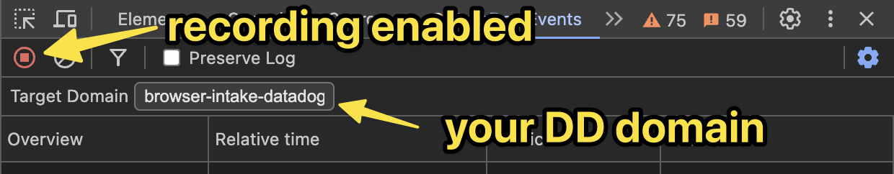

#  DataDog Event Monitor

[](https://chrome.google.com/webstore/detail/cbmkpmahhohcoocponpomeegpdlhlmim)

---

<p align="center">
    
</p>

## Description

This tiny extension parses payload of requests that your web application makes to DataDog API and displays particular events using familiar UI of the DevTools Network panel.

Testing DataDog API calls isn't the most pleasant thing you do at work. The SDK client has batching enabled by default (for good reasons!), so to find out if your event was sent, you need to search through all requests and manually split messages before formatting them as JSON. Or manually log payloads before sending, which is fine, but not convenient.

Thanks to the power of LLMs and endless hours spent on writing CSS to make the UI look like native tab in DevTools, you can enjoy your work again.

Install it via [Chrome Web Store](https://chromewebstore.google.com/detail/datadog-event-monitor/cbmkpmahhohcoocponpomeegpdlhlmim).

## FAQ

### I see no events



## Development

To set up the development environment:

1. Clone the repository:

    ```bash
    git clone https://github.com/erykpiast/datadog-viewer
    ```

2. Navigate to the project directory:

    ```bash
    cd datadog-viewer
    ```

3. Install Node.js (e.g. with [`nvm`](https://github.com/nvm-sh/nvm)) and enable corepack:

    ```bash
    nvm install
    corepack enable
    ```

4. Install dependencies:

    ```bash
    pnpm i
    ```

5. Build the project:

    ```bash
    pnpm build
    ```

6. Load the extension in Chrome:
   - Open Chrome and navigate to `chrome://extensions/`
   - Enable "Developer mode"
   - Click "Load unpacked" and select the `dist` directory of the project

## Contribution

We welcome contributions! Please follow these steps to contribute:

1. Fork the repository.
2. Create a new branch:

    ```bash
    git checkout -b feature-branch
    ```

3. Make your changes and commit them using [the conventional commits syntax](https://www.conventionalcommits.org/en/v1.0.0/).
   Please, **always** explain why you're making this change.

    ```bash
    git commit -m "fix: improve search results quality
    
    Setting Fuse threshold to 0.4 gives overall better results - tested empirically.
    "
    ```

4. Push to the branch:

    ```bash
    git push origin feature-branch
    ```

5. Open a pull request on GitHub.

For any questions or issues, please [open an issue](https://github.com/erykpiast/datadog-viewer/issues/new) on the repository.

---

Thank you for using and contributing to my first Chrome Dev Tools extension!
